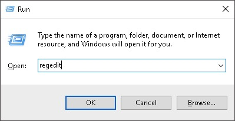
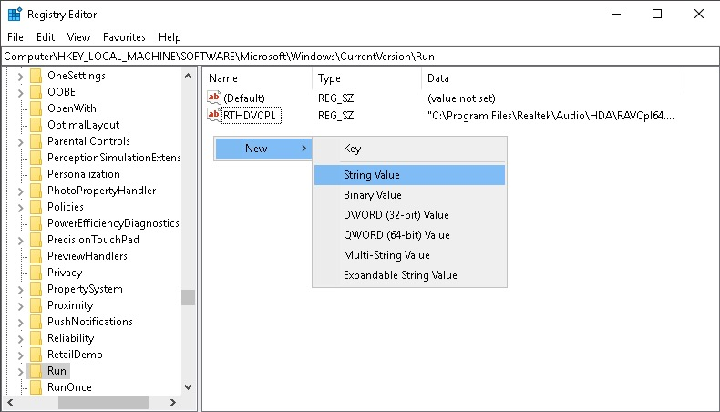
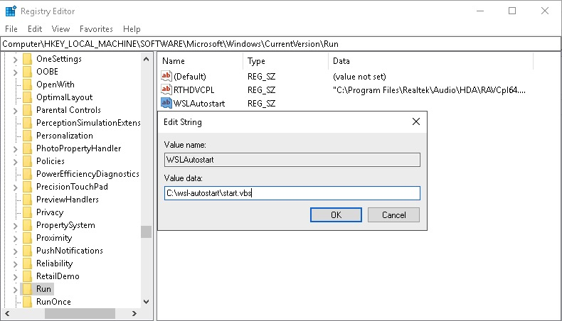

# WSL 服务自启动脚本
支持在Windows启动时启动WSL中的Linux服务.

[README](README.md) | [中文文档](README_zh.md)

## 目录

* [安装](#安装)
* [使用](#使用)

## 安装

* 使用 git clone 到任意目录 (e.g `C:\wsl-autostart`)
``` shell
git clone https://github.com/troytse/wsl-autostart
```

* 在注册表中加入启动项


* 在`HKEY_LOCAL_MACHINE\SOFTWARE\Microsoft\Windows\CurrentVersion\Run`下新增字符串项目 (e.g `WSLAutostart`)


* 设定脚本的路径 (e.g `C:\wsl-autostart\start.vbs`)


## 使用

* 修改在WSL中`/etc/sudoers`文件,为需要自启动的服务指定为免密码.
如:
``` sudoers
%sudo ALL=NOPASSWD: /etc/init.d/cron
%sudo ALL=NOPASSWD: /etc/init.d/ssh
%sudo ALL=NOPASSWD: /etc/init.d/mysql
%sudo ALL=NOPASSWD: /etc/init.d/apache2
```
* 修改`commands.txt`文件指定需要自启动的服务.
如:
``` shell
/etc/init.d/cron
/etc/init.d/ssh
/etc/init.d/mysql
/etc/init.d/apache2
```